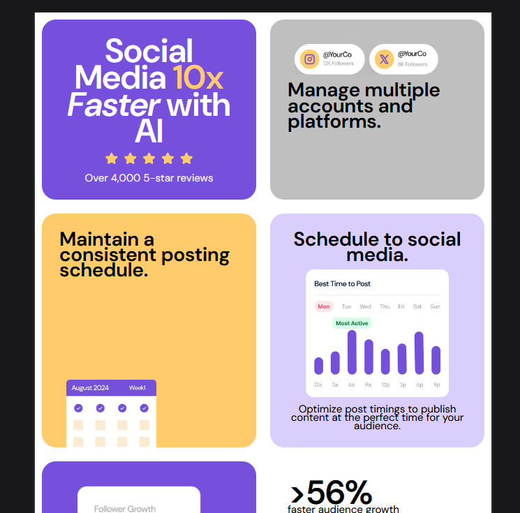
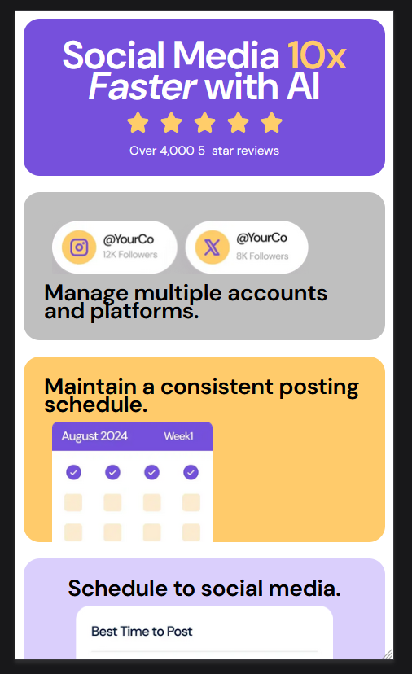

# Bento grid

[Design preview for the Bento grid coding challenge](./preview.jpg).

## Table of contents

- [Overview](#overview)
- [The challenge](#the-challenge)
- [Screenshot](#screenshot)
- [Links](#links)
- [My process](#my-process)
- [Built with](#built-with)

## Overview

### The challenge

Users should be able to:

- View the optimal layout depending on their device's screen size

### Screenshot

### Links
- Live Site URL: https://gogu69.github.io/grid/

## My process

1. Look through the designs to start planning out how you'll tackle the project
2. Structure content with HTML.
3. Create reusable styles.
4. Start adding styles.

### Built with

- CSS custom properties
- Flexbox
- Grid
- Responsive